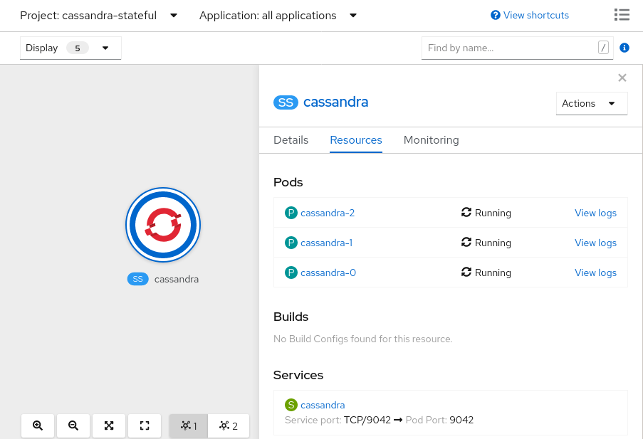
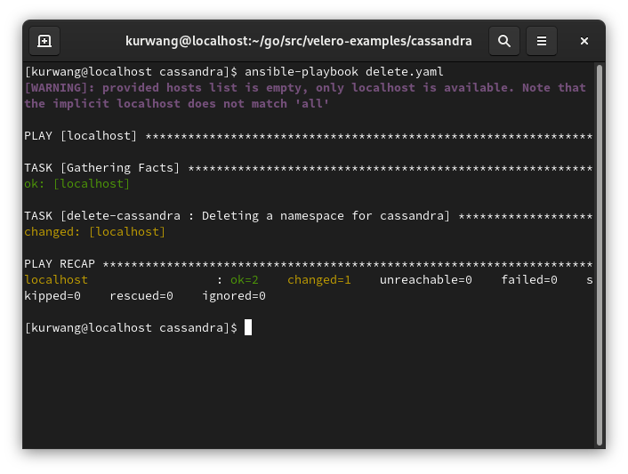

# oadp-capstone

# Step 5
## Installing a complex Application
In this step we will walkthrough the steps of installing a complex application
that will be used to demonstration the use of velero in a backup and restore scenario.

Available Applications

* [Cassandra](#installing-cassandra) 
* [Postgres](#installing-postgres) 

## Installing Cassandra
Please follow the link below for installing Cassandra.  
Running `ansible-playbook install.yaml` should set everything up.  

[Cassandra Example](https://github.com/konveyor/velero-examples/tree/master/cassandra "Cassandra")

End results should look like the following in openshift

Output should also have the looking when running the command `oc get all -n cassandra-stateful`
<pre>pod/cassandra-0   1/1     Running   0          6d1h
pod/cassandra-1   1/1     Running   0          6d1h
pod/cassandra-2   1/1     Running   0          6d1h

NAME                TYPE        CLUSTER-IP   EXTERNAL-IP   PORT(S)    AGE
service/cassandra   ClusterIP   None         &lt;none&gt;        9042/TCP   6d1h

NAME                         READY   AGE
statefulset.apps/cassandra   3/3     6d1h
</pre>

## Installing Postgres
Please follow the link below for installing Postgres.
[Postgres Example](https://github.com/devarshshah15/velero-examples/tree/debug/patroni "Postgres")

Running all the commands to install patroni will give results like the following

Output should also have the looking when running the command `oc get all -n patroni`
<pre>NAME                       READY   STATUS    RESTARTS   AGE
pod/patroni-persistent-0   1/1     Running   0          6d4h
pod/patroni-persistent-1   1/1     Running   0          6d4h
pod/patroni-persistent-2   1/1     Running   0          6d4h
pod/pgbench                1/1     Running   0          6d4h

NAME                                 TYPE        CLUSTER-IP       EXTERNAL-IP   PORT(S)    AGE
service/patroni-persistent           ClusterIP   172.30.146.208   &lt;none&gt;        5432/TCP   6d4h
service/patroni-persistent-master    ClusterIP   172.30.44.10     &lt;none&gt;        5432/TCP   6d4h
service/patroni-persistent-replica   ClusterIP   172.30.111.87    &lt;none&gt;        5432/TCP   6d4h

NAME                                  READY   AGE
statefulset.apps/patroni-persistent   3/3     6d4h
</pre>

# Step 6
## Performing a backup
Now that we have a complex application on openshift, we can demonstrate a backup on the application.  
Click the link based on which application was installed.

- [Cassandra](#cassandra-app)  
- [Postgres HA](#postgres-app)

## Cassandra App
For cassandra, all we need to do to perform the backup is running the command `ansible-playbook backup.yaml`

This will do a few things.
* Velero hooks containing commands are executing to stop writes pre-backup and start again post-backup.
* Application is also quiesced just before backup.
* Backup will then be created.

The Cassandra backup can be checked by running `velero get backups`  
Output showing Cassandra in the backup should look like the following below

## Postgres App
To start the backup, start by creating annotation of prehooks and posthooks. These will serve the purpose of enabling 
the quiesce behavior for patroni during backup.

[Detailed Directions](https://github.com/devarshshah15/velero-examples/tree/debug/patroni#quiescing-the-database "Postgres")

<pre>
oc annotate pod -n patroni \
    pre.hook.backup.velero.io/command= '["/bin/bash", "-c","patronictl pause && pg_ctl stop -D pgdata/pgroot/data"]' \
    pre.hook.backup.velero.io/container=patroni-persistent \
    post.hook.backup.velero.io/command='["/bin/bash", "-c", "patronictl resume"]'\
    post.hook.backup.velero.io/container=patroni-persistent
</pre>
Then we can run `oc create -f postgres-backup.yaml ` to create the backup itself.
Then run `oc get volumesnapshotcontent` and make sure the output looks similar to the one below.
<pre>
$ oc get volumesnapshotcontent
NAME                                                              READYTOUSE   RESTORESIZE   DELETIONPOLICY   DRIVER                       VOLUMESNAPSHOTCLASS       VOLUMESNAPSHOT                                         AGE
snapcontent-24ef293e-68b1-4f01-8d9b-673d20c6b423                  true         5368709120    Retain           rook-ceph.rbd.csi.ceph.com   csi-rbdplugin-snapclass   velero-patroni-persistent-patroni-persistent-0-6l8rf   46m
snapcontent-bea37537-a585-4c5d-a02d-ce1067f067a8                  true         5368709120    Retain           rook-ceph.rbd.csi.ceph.com   csi-rbdplugin-snapclass   velero-patroni-persistent-patroni-persistent-2-hk4pk   45m
snapcontent-c0e5a49b-e5d8-4235-8f90-96f2eedf2d04                  true         5368709120    Retain           rook-ceph.rbd.csi.ceph.com   csi-rbdplugin-snapclass   velero-patroni-persistent-patroni-persistent-1-q7nj6   46m
snapcontent-d1104635-17d9-4c83-82e4-94032b31054e                  true         2147483648    Retain           rook-ceph.rbd.csi.ceph.com   csi-rbdplugin-snapclass   velero-patroni-8gx2g                                   44m
</pre>
    
# Step 7
## Showing Backup Data in Noobaa S3 Bucket

# Step 8
## Simulating a disaster scenario
A disaster scenario of deleting the namespace will be performed to show that the restore functionalty of velero works.

Pick which app that a backup was performed with.
- [Deleting Cassandra](#deleting-cassandra)  

## Deleting Cassandra
First make sure Step 6 was performed and a Backup of Cassandra exists `velero get backups`.

Then following the [Cassandra Example](https://github.com/konveyor/velero-examples/tree/master/cassandra "Cassandra"), run the
command `ansible-playbook delete.yaml` which will delete Cassandra and perform the disaster scenario.
Output should look like the following below. Results should also show the cassandra namespace being terminated and then deleting from openshift.

